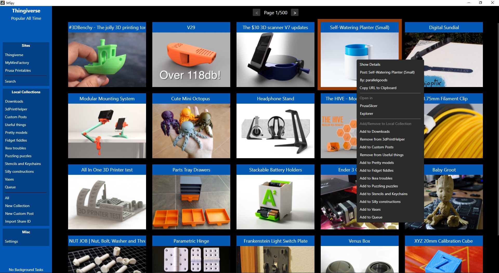

# StlSpy

StlSpy is a tool to help you download and organize 3d prints locally from multiple model website repositories. 

Current functionalities
- Browse and search model repositories
    - Thingiverse, MyMinifactory and Printables are supported
- Download model files locally
- Categorize models in collections
- Instantly open models in PrusaSlicer

### Releases
See the [Releases](https://github.com/suchmememanyskill/StlSpy/releases) page